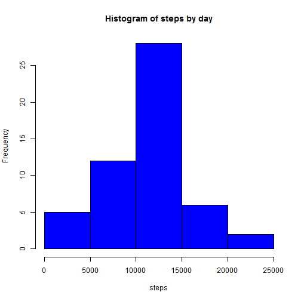
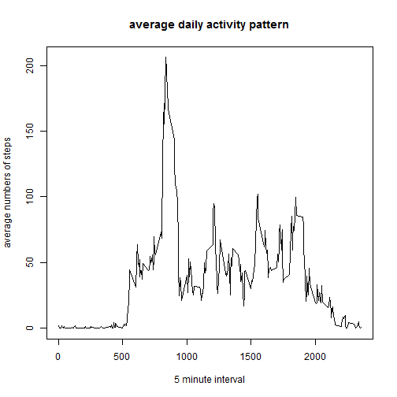
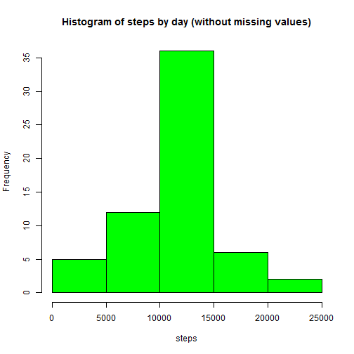
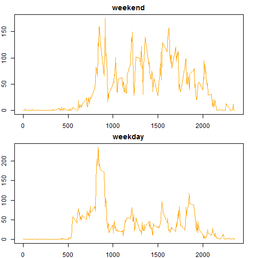

Activity monitoring
========================================================

Loading and preprocessing the data


```r
data <- read.csv("activity.csv")
```

What is mean total number of steps taken per day?


```r
dataagrbydate <- aggregate(steps ~ date, data, na.rm = TRUE, sum)
hist(dataagrbydate$steps, xlab = "steps", main = "Histogram of steps by day", col = "blue")
```

 

```r
mean(dataagrbydate$steps)
```

```
## [1] 10766
```

```r
median(dataagrbydate$steps)
```

```
## [1] 10765
```

What is the average daily activity pattern?
Which 5-minute interval, on average across all the days in the dataset, contains the maximum number of steps?


```r
dataagrbyinterval <- aggregate(steps ~ interval, data, na.rm = TRUE, mean)
plot(dataagrbyinterval$interval, dataagrbyinterval$steps, type = "l", xlab = "5 minute interval", ylab = "average numbers of steps", main = "average daily activity pattern")
```

 

```r
rowmaxsteps <- which(dataagrbyinterval$steps == max(dataagrbyinterval$steps))
dataagrbyinterval[rowmaxsteps,1]
```

```
## [1] 835
```

Count rows with Nas and replace missing values with means for the interval:

```r
dataNoNas <- read.csv("activity.csv")
countNas <- 0
for(i in 1:nrow(dataNoNas)){
  if(is.na(dataNoNas[i, 1]) == TRUE){
    countNas <- countNas + 1
    interval <- dataNoNas[i, 3]
    newstepsrow <- which(dataagrbyinterval$interval == interval)
    dataNoNas[i, 1] = dataagrbyinterval[newstepsrow, 2]
  }
}
countNas
```

```
## [1] 2304
```


Get histogram, mean mediam of total number steps by day when missing values are replaces by mean for that interval

```r
dataNoNasagrbydate <- aggregate(steps ~ date, dataNoNas, na.rm = TRUE, sum)
hist(dataNoNasagrbydate$steps, xlab = "steps", main = "Histogram of steps by day (without missing values)", col = "green")
```

 

```r
mean(dataNoNasagrbydate$steps)
```

```
## [1] 10766
```

```r
median(dataNoNasagrbydate$steps)
```

```
## [1] 10766
```
As a result, the median is closer to mean and there are more observation close to mean. The mean and median are not differen from the ones without replacing missing values.

Are there differences in activity patterns between weekdays and weekends?
create new column

```r
data$day <- NA
```


```r
for(i in 1:nrow(data)){
  if(weekdays(as.Date(data[i,2])) == "Saturday" | weekdays(as.Date(data[i,2])) == "Sunday"){
    data$day[i] <- "weekend"
  } else {
    data$day[i] <- "weekday"
    }
}

dataagrbyintervalbyday <- aggregate(steps ~ interval + day, data, na.rm = TRUE, mean)
par(mar = c(2,2,2,2), mfrow = c(2,1))

with(subset(dataagrbyintervalbyday, day == "weekend"), plot(interval, steps, type = "l", main = "weekend", xlab = "interval", ylab = "steps", col = "orange"))
with(subset(dataagrbyintervalbyday, day == "weekday"), plot(interval, steps, type = "l", main = "weekday", xlab = "interval", ylab = "steps", col = "orange"))
```

 


